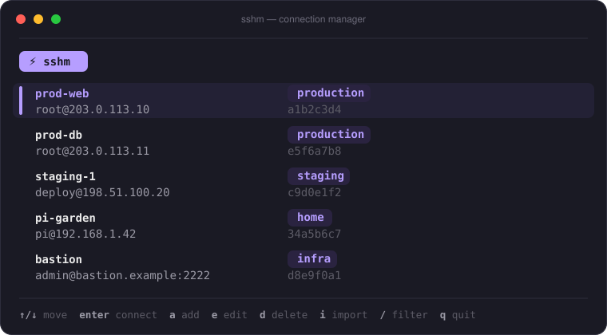

<h1 align="center">sshm</h1>

<p align="center">
  A small, fast SSH connection manager in Go — browse your hosts in a modern
  terminal UI, or connect directly from the command line like <code>ssh</code> itself.
</p>

<p align="center">
  <a href="https://github.com/Matix-Media/sshm/actions/workflows/ci.yml">
    
  </a>
  
</p>

<p align="center">
  
</p>

---

## Why

Most connection managers trap your hosts inside an interactive menu. `sshm`
keeps the nice menu **and** lets you use a saved profile straight from the shell
— so it composes with pipes and remote commands exactly like `ssh`:

```sh
infocmp -x | sshm web -- tic -x -
```

Profiles are stored as plain JSON in `~/.config/sshm/connections.json`, and can
be imported from your existing `~/.ssh/config`.

## Features

- **Interactive TUI** — styled list with group badges, fuzzy filter, and forms
  for adding/editing connections (built with [Bubble Tea](https://github.com/charmbracelet/bubbletea)).
- **Direct connect** — `sshm <id|name> [args…]` execs `ssh` in place, forwarding
  trailing arguments and passing stdin/stdout straight through.
- **Plain-text listing** — `sshm list` prints a pipe-friendly table.
- **`~/.ssh/config` import** — handles `Include`, multi-host lines, and skips
  wildcard patterns.
- **Custom commands** — per-profile overrides (e.g. `mosh`, or `ssh` with extra
  flags).

## Install

Requires **Go 1.26+**.

```sh
go install github.com/Matix-Media/sshm@latest
```

This drops the `sshm` binary in `$(go env GOPATH)/bin` (usually `~/go/bin`) —
make sure that directory is on your `PATH`.

<details>
<summary>Or build from source</summary>

```sh
git clone https://github.com/Matix-Media/sshm.git
cd sshm
go build -o sshm .
```
</details>

## Usage

```
sshm                        Open the interactive connection manager
sshm list, sshm ls          List saved connections
sshm <id|name> [args...]    Connect directly, forwarding args to ssh
sshm -h, --help             Show help
```

```sh
sshm                                 # browse and connect in the TUI
sshm list                            # show all saved connections
sshm prod-web                        # connect by name (case-insensitive)
sshm a1b2c3d4                        # …or by id
sshm web -- uptime                   # run a remote command
infocmp -x | sshm web -- tic -x -    # pipe stdin through to the remote
```

Connections can be referenced by their 8-character **id** or their **name**;
both are shown in `sshm list` and in the TUI.

### Interactive keys

| Key             | Action                     |
| --------------- | -------------------------- |
| `↑`/`↓`, `j`/`k`| Move selection             |
| `enter`         | Connect                    |
| `a`             | Add connection             |
| `e`             | Edit selected              |
| `d`             | Delete selected            |
| `i`             | Import from `~/.ssh/config`|
| `/`             | Filter                     |
| `q`             | Quit                       |

## Configuration

Profiles live in `~/.config/sshm/connections.json`. Set `SSHM_CONFIG_DIR` to
point at a different directory.

## Development

```sh
go test ./...     # unit tests
go vet ./...
gofmt -l .        # should print nothing
```

Project layout:

| Path        | Responsibility                                                        |
| ----------- | -------------------------------------------------------------------- |
| `core/`     | Data model, JSON store, `ssh_config` import, id/name resolution, command building — pure and unit-tested. |
| `tui/`      | The Bubble Tea interface: list, forms, confirm modals, theme.        |
| `main.go`   | CLI dispatch.                                                        |
| `ssh.go`    | The `syscall.Exec` handoff to `ssh`.                                 |

> `sshm.py.orig` is the original Python script this project was ported from,
> kept for reference.
